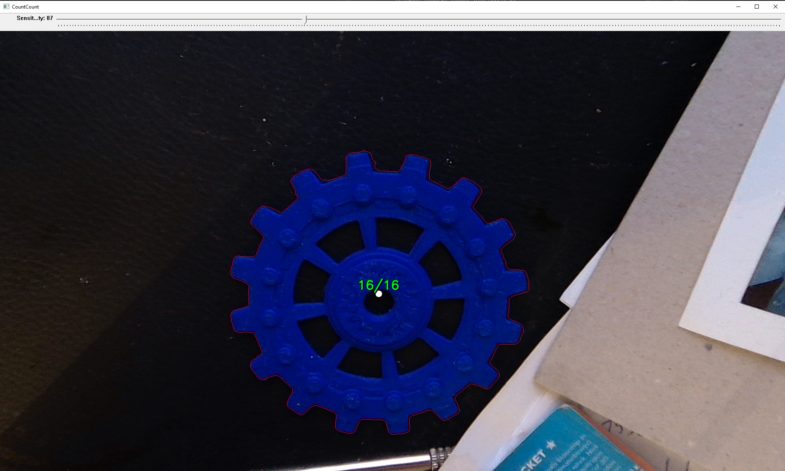

## Dependencies

The project uses the following dependencies:

- **Stb**: Image loading/saving (stb_image, stb_image_write)
- **Catch2 3.4+**: Unit testing framework
- **xsimd 14.1.0**: Header-only SIMD abstraction (AVX2 acceleration for foreground detection)
- **Standard Template Library (STL)**: C++ standard library components
- **vcpkg**: Package manager for C++ dependencies

**No OpenCV dependency** — all image processing, drawing, contour detection, and camera capture are implemented from scratch using Win32 APIs and standard C++.

Dependencies are managed using [vcpkg](https://github.com/microsoft/vcpkg).

### System Requirements

- **Platform**: Windows (uses MediaFoundation for camera, Win32 for GUI)
- **Compiler**: C++23 compatible compiler (MSVC recommended)
- **CMake**: 3.15 or higher for building

## Building the Project

1. **Clone the repository**:
   ```bash
   git clone https://github.com/grandmaster789/count_count.git
   cd CountVonCount
   ```

2. **Initialize vcpkg submodule**:
   ```bash
   git submodule update --init --recursive
   ```

3. **Build with CMake**:
   ```bash
   mkdir build
   cd build
   cmake ..
   cmake --build .
   ```

## Usage

1. **Run the application**: Execute the built binary
2. **Calibrate the segmentation**: Press **A** to auto-detect the saturation threshold that separates the gear from the background (this also runs once at startup)
3. **Adjust the sensitivity**: Use the slider to override that threshold by hand if the automatic result needs nudging
4. **Review results**: The application will display the tooth count and any detected anomalies

### Keyboard Controls

| Key       | Action                                                                       |
|-----------|------------------------------------------------------------------------------|
| **A**     | Calibrate the saturation threshold (count-guided sweep)                      |
| **F**     | Autofocus — contrast-detection focus sweep across the gear                   |
| **E**     | Auto-exposure — let the camera's AE converge, then lock it to manual         |
| **W**     | Auto white-balance — metric sweep for the Kelvin value that neutralises the scene |
| **[** / **]** | Step the camera focus value up / down by one hardware step               |
| **L**     | Toggle between live video and a frozen still of the last frame               |
| **Enter** | Cycle the view between the processed image and the masked foreground         |
| **G**     | Save the current frame as a timestamped JPG                                  |
| **D**     | Toggle debug logging (verbose pipeline output to the log file)               |
| **Q/Esc** | Quit                                                                         |

All of these except **L**, **[** / **]** and **Q/Esc** are also available as buttons in the right-hand panel — a button click simply injects the matching key, so both routes run the same code.

## Configuration

The application behavior can be customized through the configuration file (`data/count_count.cfg`). Key parameters include:

- Previously selected foreground color
- Foreground detection sensitivity
- Selected webcam identifier
- Webcam resolution

## Algorithm explanation

We start with the assumption that we're looking at a coloured gear against an achromatic background — a grey or white wall, a workbench. That lets us separate the two by *how colourful* a pixel is rather than by its exact colour, which is what keeps the segmentation standing up under shadows and changing light. The threshold that divides the two is still scene-dependent, so we provide both manual control and automatic calibration.

### Saturation Calibration (press A)

Segmentation is driven by a single number: the saturation threshold above which a pixel counts as gear. Calibration finds it without any manual input.

There are two ways to arrive at it. The cheap one, used per frame when nothing has been calibrated, builds a 256-bin histogram of subsampled pixel saturations, takes the dominant peak as the achromatic background, and returns a threshold just past its shoulder — clamped to a sane range, with a fallback if the dominant peak is itself saturated (no achromatic background to separate from). This is deliberately *not* Otsu on the saturation histogram: the gear can be a small fraction of the pixels, and Otsu then overshoots into the object's own distribution and erodes the low-saturation tooth tips.

Pressing **A** runs the thorough one instead. It is **count-guided**: rather than trusting a histogram statistic, it sweeps candidate thresholds, runs the full segment-and-count pipeline at each, and keeps the threshold whose gear contour yields the strongest *stable* tooth count. Crucially it rejects the broken-rim regime — a threshold that eats through the rim still produces a contour and a count, but the FFT estimate collapses far below the direct count, which is a reliable signature of a bad segmentation. If no plausible gear count is found anywhere in the sweep, it falls back to the histogram threshold. The search is heavy, which is why it runs at calibration time rather than every frame; the result is stored in the settings and reused.

### Processing Pipeline

**Startup (once, after the camera delivers its first frame)** — the camera is auto-tuned in a fixed order: white balance, then focus, then saturation calibration. The order matters, because white balance shifts the colours the saturation threshold is measured against, and focus affects how crisp the rim is. Exposure stays on the camera's native auto unless you lock it with **E**.

**Per frame:**

1. Grab an image from the webcam, or use the loaded static image.
2. **Segment by saturation.** The mask is 255 wherever HSV saturation is at or above the threshold. The chromatic gear is high-saturation; the achromatic grey/white background is low-saturation. This is shadow-robust: a shadow on a matte surface moves *value*, not *saturation*, whereas the earlier BGR colour-distance approach leaked shadows into the mask. The threshold comes from the settings (the slider doubles as a manual override); values below 25 are treated as "auto-calibrate from this frame" rather than as a literal threshold, since a threshold that low would flood the mask with background.
3. **Clean up the mask** with a 9×9 majority-vote filter — each pixel becomes whatever the majority of its 81 neighbours are. This removes salt-and-pepper speckle without the grey halo a linear blur would leave on a binary mask. It runs over an integral image so the cost is independent of kernel size.
4. **Trace contours** in the mask with Moore boundary tracing.
5. **Pick the gear.** Contours enclosing less than 1% of the image area (by shoelace area) are discarded as noise; of the remainder, the most circular one — highest `mean(r) / stddev(r)` about its own centroid — is taken as the gear.
6. **Compute the centroid** as the average of the contour's point coordinates, then traverse the contour again collecting each point's distance to it.
7. **Classify tooth vs gap.** The smallest distances are gaps between teeth, the largest are tooth tips. Otsu's method on the distance values finds the threshold that best separates the two populations, turning the distance sequence into a binary one.
8. **Count directly** by counting rising edges — transitions from 0 (gap) to 1 (tooth). A span filter then drops any "tooth" whose run of high points is narrower than a third of the median run length, which removes noise spikes that briefly cross the threshold.
9. **Count speculatively via FFT.** The radial profile is resampled into 1024 uniform angular bins and transformed; the frequency bin with the most power gives a tooth count directly, since a gear rim is a near-periodic signal. This is the estimator that survives fine-toothed gears, where the direct rising-edge count aliases against the contour's pixel resolution. It is the **headline count whenever it is valid**, with the direct count as the fallback.
10. **Detect anomalies** statistically — teeth whose angular width or gap to the next tooth deviates by more than three standard deviations from the mean are flagged.
11. **Smooth over time.** Both counts are pushed through a rolling mode filter over the last 10 frames, so a single bad frame cannot change the displayed number.
12. **Fit a template.** An ideal gear of the displayed tooth count is fitted to the rim (optimising phase and duty) and scored by how well it overlaps the mask. The fitted outline is drawn in cyan and the score becomes a confidence percentage. This is a confidence layer only — it never corrects the count.
13. **Display** the count and confidence in the corner, over the contour and any anomaly markers.

Two guards wrap this. If fewer than 8 teeth are found the frame is skipped entirely — that is not a gear. And if the FFT count collapses relative to the direct count for 4 consecutive frames, the mask is presumed broken and saturation calibration re-runs automatically, throttled to at most once every 30 frames because the search is expensive. Whenever the count looks broken by that measure the display shows **?** rather than a confidently wrong number — including on the frames before the streak trips and during the cooldown.

The text colour reports status, in precedence order: **red** if any anomaly was detected, otherwise **amber** if confidence is low (fit below 0.40, or a self-heal in progress), otherwise **green**.

### Moore Boundary Tracing

*(`src/processing/boundary_trace.cpp`)*

Once we have a binary mask, we need the outline of the shapes in it as an ordered list of points, not just a field of lit pixels. Moore boundary tracing walks that outline pixel by pixel.

The idea is to keep one finger on a boundary pixel and feel around it for the next one. Each pixel has eight neighbours (the *Moore neighborhood* — the four edge-adjacent plus the four diagonals). From the current pixel we scan those eight positions in clockwise order and step onto the first one that is foreground. We do not start that scan from a fixed direction: we start from the *backtrack* direction, one step back from where we just came, which is set to `(dir + 5) % 8` after every move. Starting there is what keeps the walk hugging the edge instead of cutting across the interior. Tracing stops when we arrive back at the pixel we started from.

Two details make it work on a whole image rather than a single blob:

- **Seeding.** We raster-scan the mask top-to-bottom, left-to-right, and only begin a trace on a foreground pixel that (a) has at least one background neighbour, so it really is on an edge, and (b) has background immediately to its left. That second condition means we can only ever enter a component at its leftmost boundary pixel, which stops us from re-tracing the same shape from a dozen different starting points.
- **Marking.** After a trace completes, we flood-fill the whole connected component from its boundary and mark those pixels visited, so the raster scan moves on to the next distinct shape.

A note on scope: this implementation returns **outer boundaries only**. Holes and interior contours are not traced, since the flood-fill consumes the component's interior. For a gear silhouette that is exactly what we want — we care about the toothed rim, not the bore.

### Shoelace Area

*(`src/math/geometry.h`)*

Having traced a contour, we want to know how much area it encloses. The shoelace formula (also called the surveyor's formula) computes the area of any simple polygon directly from its vertices, with no need to rasterise or fill it.

For each pair of consecutive vertices we accumulate the cross product `x_i · y_j - x_j · y_i`, wrap the last vertex around to the first, and take half the absolute value of the sum. The name comes from the criss-cross pattern the multiplications make when the coordinates are written out in two columns. Geometrically, each term is twice the signed area of the triangle formed by the origin and that edge; the contributions from edges facing away from the origin cancel against those facing towards it, leaving exactly the enclosed area.

The signed version tells you the winding direction of the contour — negative for one orientation, positive for the other. We do not need that here, so `polygon_area()` takes `fabs` and always returns a non-negative value.

In the pipeline this is a **filter, not the selector**. A contour must enclose at least 1% of the image area to be considered at all, which throws out the small specks of noise that survive the mask blur. The gear is then chosen from the survivors by radial consistency — `mean(r) / stddev(r)` of the point distances from the contour's own centroid — because the roundest large blob is a far more reliable description of a gear than the biggest one.

### Otsu's Method

*(`src/math/statistics.h` / `.inl`)*

At one point in this pipeline we have a pile of measurements that we believe come from two groups, and we need the dividing line between them without hard-coding a magic number. Otsu's method finds that line automatically.

The assumption is that the values are *bimodal* — two clusters with a valley between them. For every candidate threshold, Otsu splits the data into a low class and a high class and scores the split by its **between-class variance**:

`w0 · w1 · (mean0 - mean1)²`

where `w0` and `w1` are the number of samples on each side. The score rewards a split whose two halves have means far apart, but the `w0 · w1` factor punishes lopsided splits, so it will not cheat by shaving off a single outlier. The threshold with the highest score wins. Maximising between-class variance is mathematically equivalent to minimising the variance *within* the two classes, which is the more intuitive statement of what we want: two groups that are each internally tight.

Textbook Otsu operates on 8-bit pixel values. Ours is generalised to continuous data: it discretises the values into `bins` buckets (256 by default) spanning the observed `[min, max]` range, runs the search over the histogram, and maps the winning bin back to the original units by returning its midpoint.

The live use is **tooth classification** — over the radial distances from the contour centroid, separating tooth tips from the gaps between them. This is the step that turns a wobbly sequence of distances into a clean binary sequence we can count edges in. Because the threshold is derived from the data every frame, it adapts to a gear that moves closer to the camera, or to lighting that shifts the contrast, without any manual retuning.

The same formula is also hand-rolled in `processing/auto_sensitivity.cpp`, over a histogram of Chebyshev colour distances, to pick a colour tolerance. That belongs to the older colour-distance segmentation path — it is still built and tested, but the application no longer calls it now that segmentation is saturation-based.

### Statistical Anomaly Detection

*(`src/processing/anomalies.cpp`)*

Counting teeth tells us how many there are; it does not tell us whether one is broken. For that we lean on the fact that a manufactured gear is extremely regular — every tooth is about as wide as every other, and every gap is about as wide as every other. A defect is a break in that regularity, so we can find it as a statistical outlier without knowing anything about what the gear is supposed to look like.

Two series are collected, both measured as **angles around the centroid** rather than pixel distances, which keeps them independent of the gear's size in frame:

- **Tooth arcs** — the angular span from each tooth's starting angle to its ending angle, i.e. how wide the tooth is.
- **Gaps** — the angular span from each tooth's ending angle to the *next* tooth's starting angle. The list wraps around, so the last tooth is measured against the first.

For each series we compute the mean and the standard deviation, then flag any measurement more than **three standard deviations** from its mean. Under a roughly normal distribution, 3σ covers about 99.7% of samples, so a genuinely regular gear should produce no flags at all — the threshold is deliberately liberal, because a false alarm on a good gear is more annoying than a missed hairline defect. The two tests are independent and their results are OR'd into a per-tooth bitmask, so a tooth can be flagged for an abnormal arc, an abnormal gap, or both. A snapped-off tooth typically shows up as an oversized gap; a chipped one as an undersized arc.

The variance uses **Bessel's correction** — dividing by `N - 1` instead of `N`. We are estimating the spread of the manufacturing process from a limited sample of teeth, and the naive `N` divisor systematically underestimates it, which would make the 3σ band too narrow and produce false positives. With a couple of dozen teeth the difference is small but free to correct for.

The known limitation is worth stating precisely, because it follows from the method itself: **the mean and standard deviation are estimated from the very population that contains the defects.** A single broken tooth barely moves them and stands out cleanly. Several broken teeth inflate σ, widening the 3σ band until the defects fall inside it and mask themselves — and if every tooth is worn the same way, "regular" simply becomes the new normal and nothing is flagged. This detector answers "is anything unusual *for this gear*", not "does this gear match its specification".

## Screenshots



## Testing

The project includes test images for validation:

- `test_gear_001.jpg`, `test_gear_002.jpg`, `test_gear_003.jpg`: Normal gears for testing basic counting functionality
- `test_broken_tooth_001.jpg`, `test_broken_tooth_002.jpg`: Gears with defects for testing anomaly detection

## Contributing

1. Fork the repository
2. Create a feature branch
3. Make your changes
4. Add tests for new functionality
5. Submit a pull request

## References

- [C++ Reference](https://en.cppreference.com/w/)

## License

See the [LICENSE](LICENSE) file for details.